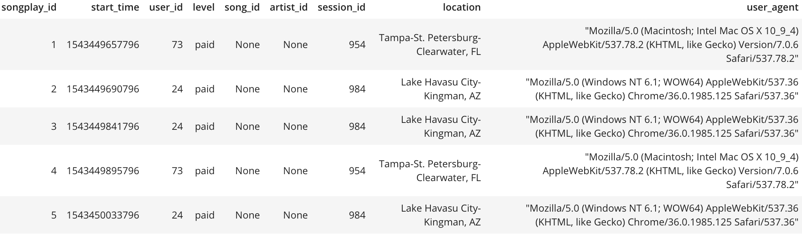
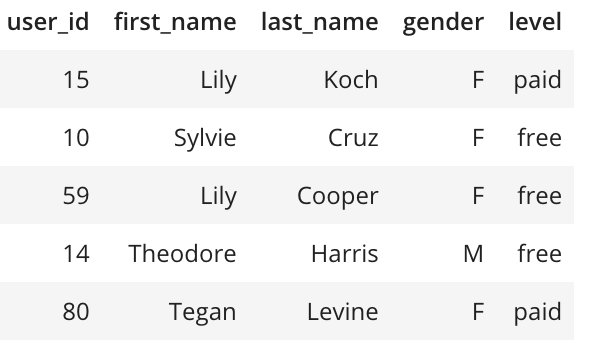
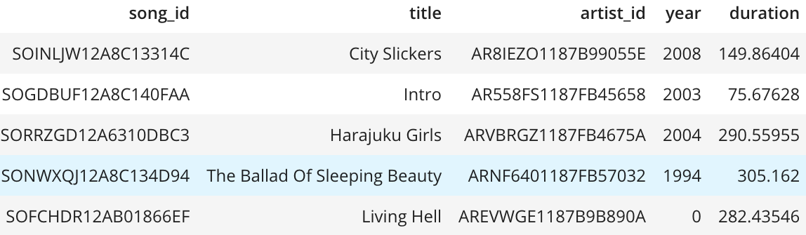
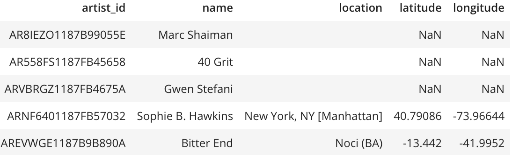
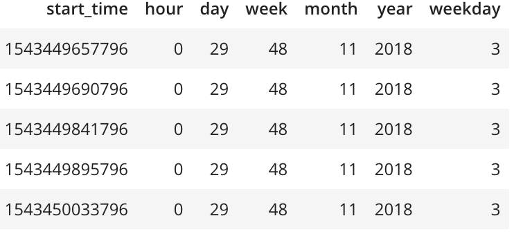

# Udacity Data Modeling with Postgres
By Hao Xu
******
## 1. Project Overview
A imaginary startup company called Sparkify wants to analyze the data they've been collecting on songs and user activity on their new music streaming app. Currently, they don't have an easy way to query their data, which resides in a directory of JSON logs on user activity on the app, as well as a directory with JSON metadata on the songs in their app.They'd like to create a Postgres database with tables designed to optimize queries on song play analysis.

and write an ETL pipeline that transfers data from files in two local directories into these tables in Postgres using Python and SQL. 

## 2. Database Schema
In this project, I define fact and dimension tables for a star schema for a particular analytic focus. The tables are:

1. songplays(**Fact table**, record every user action, 9 columns) 
    - songplay_id (the primary key, and is serial data type)
    - start_time (a timestamp, use bigint data type)
    - user_id (int)
    - level (two choice, free and paid, char(4))
    - song_id (varchar)
    - artist_id (varchar)
    - session_id (int)
    - location (the address, varchar)
    - user_agent (the browser, varchar)
    
  

2. users(*Dimension table*,contain user information, has 5 columns)
    - user_id (int)
    - first_name (varchar)
    - last_name (varchar)
    - gender (two choice,'M' or 'F', char(1))
    - level (two choice, 'free' and 'paid', char(4))
    
       

3. songs(*Dimension table*,contain song information, has 5 columns)
    - song_id (varchar)
    - title (varchar)
    - artist_id (varchar)
    - year (int)
    - duration (in seconds, numeric)
    
       

4. artists(*Dimension table*,contain artists information, has 5 columns)
    - artist_id (varchar)
    - name (varchar)
    - location (varchar)
    - latitude (numeric)
    - longitude (numeric)
    
    

5. time(*Dimension table*,contain time information, has 7 columns)
    - start_time (timestamp, bigint)
    - hour (int)
    - day (int)
    - week (int)
    - month (int)
    - year (int)
    - weekday (int)
    
     

## 3. ETL pipeline
1. Extract
I extract all necessary information from json files in two folders using pandas.
2. Transform
I use some build-in functions in pandas to transform timestamp information to day, month,year and so on.

I also set dataframe to arrage data I need to a required order and format
3. Load
I use psycopg2 to load these data to the sparkifydb database.

## 4. Simple query
`%sql SELECT gender,COUNT(gender) FROM (SELECT user_id, MAX(gender) gender FROM users GROUP BY user_id) AS a GROUP BY gender;`

gender 	count
     F 	55
     M 	41
We can see there are more female users than male users

`%sql SELECT Level,COUNT(Level) FROM (SELECT user_id, MAX(level) AS Level FROM users GROUP BY user_id) AS a GROUP BY Level;`
level 	count
 free 	74
 paid 	22
 We can see there are more free users than paid users
 
For there are not enough data, I will make further analysis in pyspark section. including using window and lambda functions.

Contract: <edifierxuhao123@gmail.com>